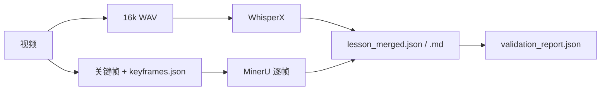

# video-raw-ingest 工程说明（方案依据与长期维护）

本文档描述 **设计目标、数据流、模块职责、目录约定、依赖与运维**，作为本仓库的**权威工程说明**；变更流水线行为时请同步更新本文档与 `README.md`。

---

## 1. 定位与边界

### 1.1 目标

从**单节课程视频**产出「原始多模态文本」的**结构合并**结果，供下游 **data-juicer 或其它清洗项目** 消费：

- **口播**：WhisperX 转写 + 字级/段级时间对齐（输出以段为主）。
- **画面**：内置关键帧抽取（对齐 `extract-video-ppt`/`evp` 思路）→ 每帧 **MinerU** 转 Markdown。
- **合并**：按时间线把 `speech` 与 `visual` 并列写入 `lesson_merged.json` / `lesson_merged.md`，**不做语义合并**（语义合并属于后续「蒸馏」步骤）。

### 1.2 明确不包含

- data-juicer 或任何「清洗后终稿」
- 向量库 / RAG / Agent / DSPy
- 对「烂课」自动救回（无 PPT、镜头乱晃等）——由业务侧弃课或人工筛选

---

## 2. 总体架构

**默认串行执行**（避免 GPU 上 WhisperX 与 MinerU 同时占显存）。需要并行时应在不同进程/不同机器拆分。

---

## 3. 目录与产物

### 3.1 单课输出目录（`run` 默认）

以 `<out_dir>/` 为根（例如 `/root/autodl-tmp/raw-ingest/课程/第01讲/`）：

| 路径 | 说明 |
|------|------|
| `_work/audio_16k.wav` | FFmpeg 抽取的单声道 16kHz PCM |
| `whisperx/segments.json` | 口播段 + 模型元数据 |
| `whisperx/raw_aligned.json` | WhisperX 对齐后的原始 JSON（排障） |
| `slides/frames/*.jpg` | 关键帧图片 |
| `slides/keyframes.json` | 关键帧元数据（含 `timestamp_sec`、`frame_relpath`） |
| `slides/slides.json` | 每帧 MinerU 结果汇总（便于断点续跑 `--skip-mineru`） |
| `slides/mineru/NNNN/` | MinerU 各帧输出目录（以工具实际结构为准） |
| **`lesson_merged.json`** | **主交付物**：结构合并 |
| **`lesson_merged.md`** | 人类可读并列视图 |
| **`validation_report.json`** | Schema + 硬规则校验结果 |

### 3.2 `lesson_merged.json` 约定

- **`schema_version`**：当前为 `"1.0"`；破坏性变更时递增并在本文档记录迁移说明。
- **`speech.empty` / `visual.empty` / `flags.*`**：便于下游区分「合法空」（如静音段）与数据异常（由校验报告进一步说明）。
- **`merged.timeline`**：按 `start_sec` 排序的并列事件（`speech` / `visual`），**非语义重写**。

JSON Schema 见：

- 包内：`src/video_raw_ingest/lesson_merged.schema.json`（随包分发）
- 仓库副本：`schema/lesson_merged.schema.json`

---

## 4. 模块说明

| 模块 | 职责 |
|------|------|
| `paths.py` | `RAW_INGEST_*` 环境变量与输出镜像规则（对齐 `video-asset-pipeline` 的 AutoDL 习惯） |
| `ffmpeg_util.py` | `ffprobe`、时长、视频 FPS 近似、`ffmpeg` 抽 WAV |
| `slide_extract.py` | 每秒采样 + BGR 直方图相关度；输出 `slides/frames` 与 `keyframes.json`；**VFR 下时间戳为近似** |
| `whisperx_run.py` | WhisperX 转写 + 对齐；无语音段时跳过 align |
| `mineru_run.py` | 子进程调用 `mineru`（或 `MINERU_PYTHON -m mineru`）；聚合 `*.md` |
| `merge.py` | 生成 `lesson_merged.*` |
| `validate.py` | `jsonschema` + 路径存在性等硬规则；写 `validation_report.json` |
| `cli.py` | `run` 子命令与 `--skip-*` 断点续跑 |

---

## 5. 关键设计决策（维护时需知）

### 5.1 为何内置抽帧而非直接调用 `evp`

PyPI `extract-video-ppt` 的 `evp` 在生成 PDF 后会删除临时 JPG，**不保留**带时间戳的逐帧资产，难以直接对接 MinerU。本仓库抽帧算法与 `wudududu/extract-video-ppt` **同类**（每秒采样 + 帧间相似度），并**持久化**帧图与 `keyframes.json`。

### 5.2 时间戳与 VFR

抽帧使用 **ffprobe 推断的 FPS** 计算 `timestamp_sec = frame_index / fps`。对 **VFR（可变帧率）** 视频，该值为**近似**；若课程源高度 VFR，应在业务侧转码为 CFR 或在后续版本改为基于 `CAP_PROP_POS_MSEC` 的采样（需评估性能）。

### 5.3 MinerU 与 PyTorch 版本

WhisperX 与 MinerU 可能依赖不同 **torch** 版本。推荐：

- 在 AutoDL 上使用官方文档推荐的 **CUDA + torch** 组合；
- 若冲突，可用 **`MINERU_PYTHON`** 指向另一虚拟环境中的 Python，仅用于执行 `python -m mineru`（见 `mineru_run.resolve_mineru_command`）。

### 5.4 MinerU 失败策略

- 默认：**记录 `mineru_error` 并继续**下一帧。
- `--mineru-fail-fast`：任一帧失败则停止（适合调试）。

### 5.5 校验策略

- **Schema**：`lesson_merged.schema.json`。
- **硬规则**：帧文件存在性、`duration_sec` 符号、可选 `--require-speech` / `--require-visual-text`。
- **退出码**：校验失败时 CLI 返回 **2**（与「参数/文件错误」区分）。

---

## 6. 环境变量一览

| 变量 | 含义 |
|------|------|
| `RAW_INGEST_OUTPUT_ROOT` | 输出根目录 |
| `RAW_INGEST_INPUT_ROOT` / `RAW_INGEST_BATCH_INPUT` | 输入根，用于镜像子路径 |
| `RAW_INGEST_REPO_OUTPUT` | `1` 时强制输出到仓库内 `output/` |
| `HF_ENDPOINT` | Hugging Face 镜像（如 `https://hf-mirror.com`） |
| `FFMPEG_BIN` / `FFPROBE_BIN` | 覆盖可执行路径 |
| `MINERU_BIN` | MinerU 可执行文件路径 |
| `MINERU_PYTHON` | 用于 `python -m mineru` 的解释器 |
| `MINERU_BACKEND` | 传给 MinerU 的 `-b`（可被 CLI `--mineru-backend` 覆盖） |

---

## 7. 版本与变更记录

| 版本 | 说明 |
|------|------|
| 0.1.0 | 首版：run 流水线、Schema、硬校验、AutoDL 文档 |

**维护约定**：修改 `merged` 结构或默认行为时，请：

1. 更新 `lesson_merged.schema.json`（包内 + `schema/` 副本保持一致）  
2. 更新本文档与 `README.md`  
3. 在上方版本表追加一行  

---

## 8. 相关文档

- [AUTODL.md](./AUTODL.md) — 云端实例上的克隆、venv、批量脚本  
- 上游项目参考：`video-asset-pipeline`（仅路径/习惯参考，无代码依赖）
